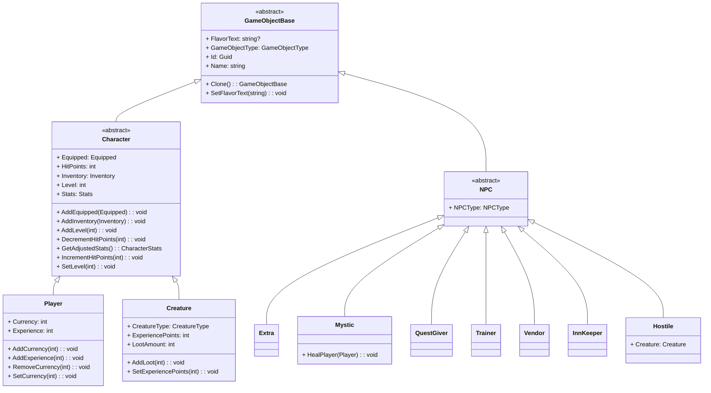

# Characters

```mermaid
classDiagram
    class GameObjectBase {
        <<abstract>>
        + FlavorText: string?
        + GameObjectType: GameObjectType
        + Id: Guid
        + Name: string
        + Clone(): GameObjectBase
        + SetFlavorText(string): void
    }
    
    class Character {
        <<abstract>>
        + Equipped: Equipped
        + HitPoints: int
        + Inventory: Inventory
        + Level: int
        + Stats: Stats
        + AddEquipped(Equipped): void
        + AddInventory(Inventory): void
        + AddLevel(int): void
        + DecrementHitPoints(int): void
        + GetAdjustedStats(): CharacterStats
        + IncrementHitPoints(int): void
        + SetLevel(int): void
    }
    
    class Player {
        + Currency: int
        + Experience: int
        + AddCurrency(int): void
        + AddExperience(int): void
        + RemoveCurrency(int): void
        + SetCurrency(int): void
    }
    
    class Creature {
        + CreatureType: CreatureType
        + ExperiencePoints: int
        + LootAmount: int
        + AddLoot(int): void
        + SetExperiencePoints(int): void
    }
    
    class NPC {
        <<abstract>>
        + NPCType: NPCType
    }
    
    class Extra {

    }
    
    class Mystic {
        + HealPlayer(Player): void
    }
    
    class QuestGiver {

    }
    class Trainer {

    }
    class Vendor {

    }
    class InnKeeper {

    }
    class Hostile {
        + Creature: Creature
    }
    
    GameObjectBase <|-- Character
    GameObjectBase <|-- NPC
    Character <|-- Player
    Character <|-- Creature
    NPC <|-- Extra
    NPC <|-- Mystic
    NPC <|-- QuestGiver
    NPC <|-- Trainer
    NPC <|-- Vendor
    NPC <|-- InnKeeper
    NPC <|-- Hostile
```
