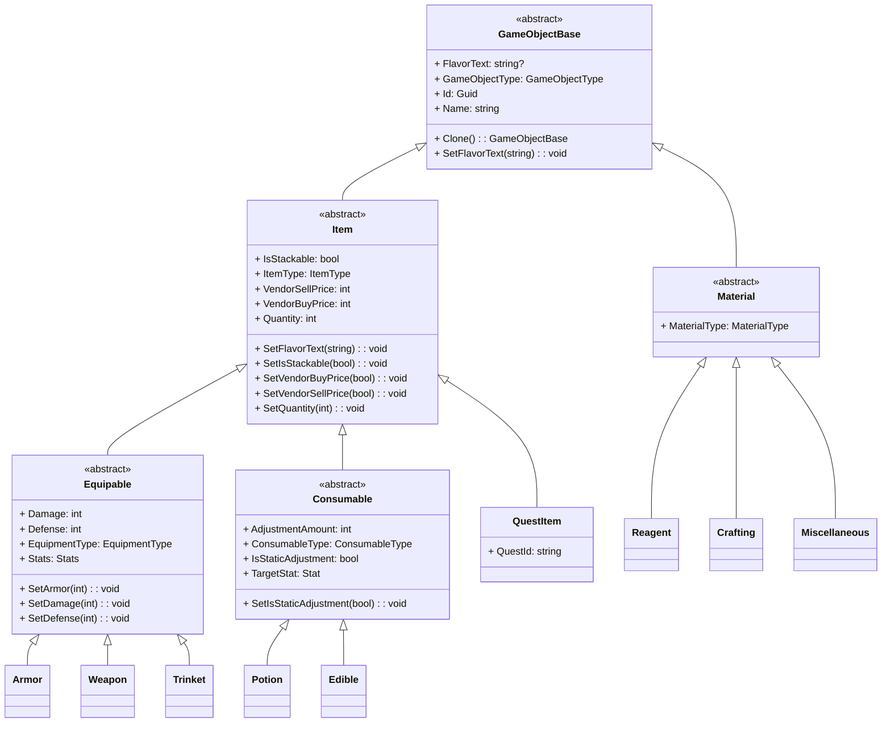

# Items

```mermaid
classDiagram
    class GameObjectBase {
        <<abstract>>
        + FlavorText: string?
        + GameObjectType: GameObjectType
        + Id: Guid
        + Name: string
        + Clone(): GameObjectBase
        + SetFlavorText(string): void
    }
    
    class Item {
        <<abstract>>
        + IsStackable: bool
        + ItemType: ItemType
        + VendorSellPrice: int
        + VendorBuyPrice: int
        + Quantity: int
        + SetFlavorText(string): void
        + SetIsStackable(bool): void
        + SetVendorBuyPrice(bool): void
        + SetVendorSellPrice(bool): void
        + SetQuantity(int): void
    }
    
    class Equipable {
        <<abstract>>
        + Damage: int
        + Defense: int
        + EquipmentType: EquipmentType
        + Stats: Stats
        + SetArmor(int): void
        + SetDamage(int): void
        + SetDefense(int): void
    }
    
    class Consumable {
        <<abstract>>
        + AdjustmentAmount: int
        + ConsumableType: ConsumableType
        + IsStaticAdjustment: bool
        + TargetStat: Stat
        + SetIsStaticAdjustment(bool): void
    }
    
    class QuestItem {
        + QuestId: string
    }
    
    class Material {
        <<abstract>>
        + MaterialType: MaterialType
    }
    
    class Armor {

    }
    class Weapon {

    }
    class Trinket {

    }
    class Potion {

    }
    class Edible {
        
    }
    class Reagent {

    }
    class Crafting {

    }
    class Miscellaneous {
        
    }
    
    GameObjectBase <|-- Item
    GameObjectBase <|-- Material
    Item <|-- Equipable
    Item <|-- Consumable
    Item <|-- QuestItem
    Equipable <|-- Armor
    Equipable <|-- Weapon
    Equipable <|-- Trinket
    Consumable <|-- Potion
    Consumable <|-- Edible
    Material <|-- Reagent
    Material <|-- Crafting
    Material <|-- Miscellaneous

```